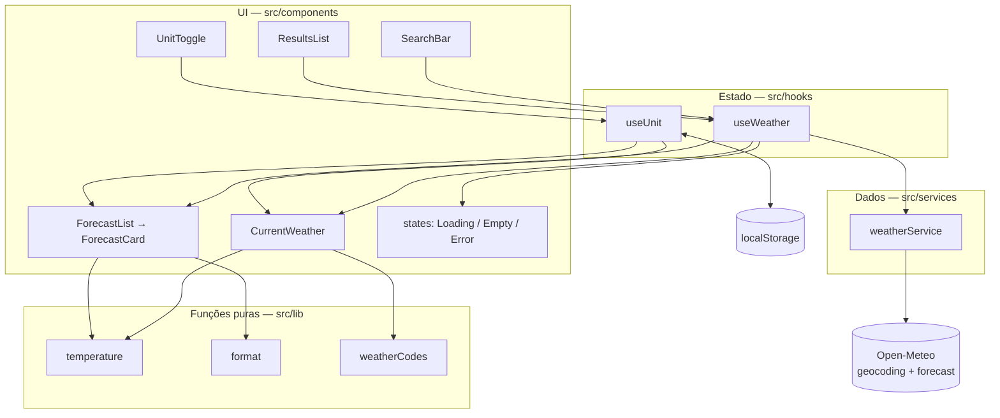
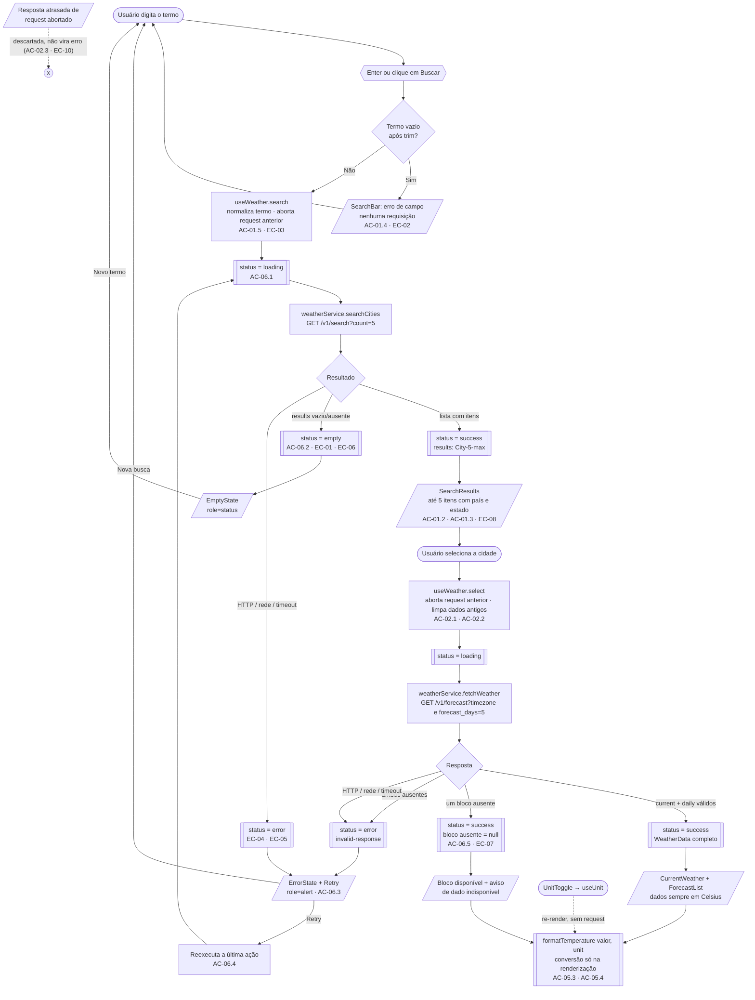

# Weather App — Technical Plan

> Fonte da verdade: [`specs/weather-app-spec.md`](../specs/weather-app-spec.md).
> Cada decisão abaixo referencia os requisitos (FR/NFR/AC/EC) que a justificam.

## 1. Architecture

SPA front-end sem backend próprio (Assumption §7). Três camadas, com dependência
sempre em uma única direção: **UI → Hook (estado) → Service (dados)**.



### 1.1 Responsabilidade de cada camada

| Camada | Pasta | Faz | Não faz |
| --- | --- | --- | --- |
| Apresentação | `components/` | Renderiza props, dispara callbacks, aplica roles/labels e Tailwind | `fetch`, decidir estado global, converter unidade por conta própria |
| Orquestração | `hooks/` | Máquina de estados, cancelamento, persistência da unidade | Montar URL, conhecer o formato da Open-Meteo, renderizar JSX |
| Dados | `services/` | HTTP, timeout, validação e tradução DTO → domínio | Importar React, guardar estado, formatar texto para UI |
| Puras | `lib/` | Conversão, formatação `Intl`, mapeamento WMO | Efeitos colaterais, I/O, acesso a `window` |
| Contratos | `types/` | Tipos de domínio compartilhados | Qualquer runtime (só `type`/`interface`) |

### 1.2 Regra de dependência

A dependência aponta sempre para dentro: `components → hooks → services → lib`.
`lib/` e `types/` não importam nada do projeto; `services/` importa apenas
`types/` e `lib/`. Nenhuma camada importa uma camada acima dela.

Consequências práticas:

- Trocar a Open-Meteo por outro provedor toca **só** `services/`, porque o
  formato da API nunca vaza para o hook ou para a UI.
- Trocar `useReducer` por uma biblioteca de estado toca **só** `hooks/`, porque a
  UI depende do contrato `UseWeatherResult`, não da implementação.
- Redesenhar a UI não pode quebrar regra de negócio: não há nenhuma em
  `components/`.

### 1.3 Como isso facilita os testes

| Alvo | Como é testado | Por que é barato |
| --- | --- | --- |
| `lib/` | Chamada direta, entrada → saída | Função pura: sem mock, sem DOM, sem async |
| `services/` | `fetch` mockado + fixtures JSON | Não importa React: nada de render ou `act()` |
| `hooks/` | `renderHook` + service mockado | Estados de erro/vazio/parcial viram um mock, não uma API real |
| `components/` | Testing Library, dados por props | Cada estado (loading/vazio/erro/sucesso/parcial) é só uma prop diferente |
| Fluxo completo | Playwright com rotas interceptadas | Única camada que atravessa tudo; poucos testes, alto valor |

O ponto central: **os estados difíceis da spec (AC-06.x, EC-07) são alcançáveis
sem rede**, porque a fronteira service ↔ hook é um contrato injetável e os
componentes não sabem de onde os dados vieram.

## 2. Tech Stack

| Camada | Escolha | Justificativa |
| --- | --- | --- |
| Linguagem | TypeScript (strict) | Contratos explícitos e refactor seguro (NFR-08). |
| UI | React 19 + Vite | SPA leve, HMR rápido, build estático servível por HTTPS (NFR-07). |
| Estilo | Tailwind CSS (tema dark glassmorphism) | Mobile-first por padrão, sem CSS morto (NFR-04). |
| Estado | `useState`/`useReducer` + hooks próprios | Escopo pequeno; biblioteca de estado global seria over-engineering. |
| HTTP | `fetch` nativo + `AbortController` | Zero dependências; cancelamento nativo cobre AC-02.3 e EC-10. |
| Dados | Open-Meteo (geocoding + forecast) | Sem API key, sem segredo no bundle (NFR-07). |
| Testes unit | Vitest + Testing Library + jsdom | Testes por comportamento acessível (NFR-03). |
| Testes E2E | Playwright | Multi-browser, cobre NFR-06. |
| Lint/format | Biome | Ferramenta única, rápida. |
| Pacotes | pnpm | Padrão do repositório. |

Decisão explícita: **sem** React Query/Zustand/Axios/date-fns. O volume de estado
é uma única requisição por ação do usuário; `Intl` cobre formatação de data.

Orçamentos e restrições derivados dos NFRs:

- **Contraste:** os tokens de cor do tema dark são definidos uma única vez em
  `tailwind.config.js` e devem atingir 4.5:1 sobre o fundo; texto secundário
  usa um token próprio já verificado, em vez de opacidade arbitrária (NFR-03).
- **Bundle:** sem dependência de runtime além de React/React DOM, o que sustenta
  a meta de p95 ≤ 2 s em 4G (NFR-01).
- **Usabilidade:** uma única ação primária por tela (buscar), rótulos em pt-BR e
  nenhum estado sem texto explicativo (NFR-02).

## 3. Project Structure

```text
src/
  main.tsx                  # bootstrap React
  App.tsx                   # composição de layout + orquestração dos hooks
  components/
    SearchBar.tsx           # input + submit + validação de vazio (FR-01, EC-02)
    SearchResults.tsx       # lista de até 5 cidades com contexto (AC-01.2/01.3)
    CurrentWeather.tsx      # painel de clima atual (FR-03)
    ForecastList.tsx        # 5 dias (FR-04)
    ForecastCard.tsx        # item diário
    UnitToggle.tsx          # C/F (FR-05)
    states/
      LoadingState.tsx      # AC-06.1
      EmptyState.tsx        # AC-06.2
      ErrorState.tsx        # AC-06.3 + retry (AC-06.4)
  hooks/
    useWeather.ts           # busca, seleção, loading/erro/vazio, last-action-wins
    useUnit.ts              # unidade ativa + persistência local (AC-05.5/05.6)
  services/
    weatherService.ts       # geocoding + forecast, timeout, mapeamento p/ domínio
  lib/
    temperature.ts          # conversão e arredondamento (AC-05.4)
    format.ts               # datas, horas e percentuais em pt-BR
    weatherCodes.ts         # WMO code → { label, icon }
  types/
    weather.ts              # contratos de domínio compartilhados
  styles/index.css          # Tailwind + tokens do tema
tests/
  setup.ts                  # jest-dom + cleanup
  unit/                     # Vitest — espelha a estrutura de src/
  e2e/                      # Playwright — fluxos da spec
```

Convenções da estrutura:

- **Um componente por arquivo**, nomeado igual ao arquivo (PascalCase).
- **Agrupamento por camada, não por feature.** Com uma única feature, pastas por
  feature só adicionariam profundidade sem ganho.
- `components/states/` isola os três estados transversais, evitando que cada
  componente reinvente sua própria mensagem de loading/erro/vazio.
- Sem `index.ts` de barril: imports diretos mantêm o grafo de dependências
  legível e evitam ciclos acidentais entre camadas.
- Cada arquivo de `lib/`, `services/` e `hooks/` tem um arquivo de teste
  correspondente em `tests/unit/` — a ausência de par é sinal de lacuna.

## 4. Data Model

Contratos de domínio (não são os DTOs da API — o service faz a tradução).

```ts
// src/types/weather.ts

/**
 * Unidade de exibição escolhida pelo usuário (FR-05).
 * Internamente todo valor numérico é mantido em Celsius; esta unidade só
 * afeta a formatação na renderização.
 */
export type Unit = 'celsius' | 'fahrenheit';

/**
 * Localidade retornada pelo geocoding (FR-01).
 * Só contém o necessário para exibir a opção e consultar o forecast.
 */
export interface City {
  /** `results[].id` — identificador estável da Open-Meteo; usado como React key. */
  id: number;
  /** `results[].name` — nome da localidade, já localizado por `language=pt`. */
  name: string;
  /** `results[].country` — país; desambigua homônimos (AC-01.3, EC-08). */
  country: string;
  /** `results[].admin1` — estado/região; nem toda localidade possui (AC-01.3). */
  admin1?: string;
  /** `results[].latitude` — entrada do forecast. */
  latitude: number;
  /** `results[].longitude` — entrada do forecast. */
  longitude: number;
  /** `results[].timezone` — IANA (ex.: "America/Sao_Paulo"); base do recorte de dias (AC-04.4). */
  timezone: string;
}

/**
 * Condições atuais da localidade selecionada (FR-03).
 * Temperaturas sempre em °C; vento sempre em km/h.
 */
export interface CurrentWeather {
  /** `current.temperature_2m` — temperatura do ar a 2 m, em °C (AC-03.1). */
  temperature: number;
  /** `current.apparent_temperature` — sensação térmica, em °C (AC-03.4). */
  apparentTemperature: number;
  /** `current.relative_humidity_2m` — umidade relativa em % (0..100) (AC-03.4). */
  humidity: number;
  /** `current.wind_speed_10m` — velocidade do vento a 10 m, em km/h (AC-03.4). */
  windSpeed: number;
  /** `current.weather_code` — código WMO; vira texto + ícone via `lib/weatherCodes` (AC-03.2). */
  weatherCode: number;
  /** `current.time` — ISO sem offset, já no fuso da localidade (ex.: "2026-08-26T14:00") (AC-03.3). */
  time: string;
}

/**
 * Um dia da previsão (FR-04). Índice `i` dos arrays `daily` da Open-Meteo.
 * Temperaturas sempre em °C.
 */
export interface ForecastDay {
  /** `daily.time[i]` — "YYYY-MM-DD" no fuso da localidade; `[0]` é hoje (AC-04.1, AC-04.4). */
  date: string;
  /** `daily.temperature_2m_min[i]` — mínima do dia, em °C (AC-04.5). */
  min: number;
  /** `daily.temperature_2m_max[i]` — máxima do dia, em °C (AC-04.5). */
  max: number;
  /** `daily.weather_code[i]` — código WMO do dia (AC-04.3). */
  weatherCode: number;
  /** `daily.precipitation_probability_max[i]` — probabilidade máxima de chuva em % (AC-04.5). */
  precipitationProbability: number;
}

/**
 * Agregado entregue à UI: cidade + clima atual + 5 dias.
 * `current` e `forecast` são anuláveis para suportar resposta parcial sem
 * quebrar a renderização (AC-06.5, EC-07).
 */
export interface WeatherData {
  /** Cidade selecionada; fonte do título e do contexto geográfico (FR-03). */
  city: City;
  /** `null` quando o bloco `current` veio ausente ou inválido. */
  current: CurrentWeather | null;
  /** Exatamente 5 itens quando presente; `null` quando o bloco `daily` falhou. */
  forecast: ForecastDay[] | null;
}
```

Notas de modelagem:

- **Sem unidades no modelo.** As unidades são fixadas na query (`celsius`,
  `kmh`) e conhecidas por contrato, então não trafegam como campo. Isso evita a
  classe inteira de bugs de "valor sem unidade correspondente" (AC-05.3, EC-09).
- **Campos deliberadamente fora do escopo:** pressão, precipitação acumulada,
  índice UV, nascer/pôr do sol e previsão horária. Nenhum é exigido por FR-03 ou
  FR-04; incluir agora seria over-engineering.
- **`weatherCode` permanece numérico** no modelo. Rótulo e ícone são derivados na
  apresentação por `lib/weatherCodes.ts`, o que mantém o domínio livre de texto
  de UI e facilita i18n.
- **Arrays paralelos → objetos.** A Open-Meteo devolve `daily` como arrays
  paralelos; o service transpõe para `ForecastDay[]`, e a UI nunca lida com
  índices.
- **Validação mínima no service:** um bloco é considerado inválido (→ `null`)
  quando algum campo obrigatório está ausente ou não é numérico.

Contratos de serviço e erro:

```ts
// src/services/weatherService.ts (contrato)

export type WeatherErrorKind = 'network' | 'timeout' | 'http' | 'invalid-response';

export class WeatherError extends Error {
  readonly kind: WeatherErrorKind;
  readonly status?: number;
}

export interface WeatherService {
  /** Normaliza o termo, consulta geocoding e devolve no máximo 5 cidades. */
  searchCities(query: string, signal?: AbortSignal): Promise<City[]>;
  /** Busca clima atual + 5 dias para a cidade selecionada. */
  fetchWeather(city: City, signal?: AbortSignal): Promise<WeatherData>;
}
```

Contratos de estado:

```ts
// src/hooks/useWeather.ts (contrato)

export type Status = 'idle' | 'loading' | 'success' | 'empty' | 'error';

export interface UseWeatherResult {
  status: Status;
  results: City[];          // resultados de geocoding pendentes de seleção
  data: WeatherData | null; // dados da cidade selecionada
  error: WeatherError | null;
  search(term: string): void;
  select(city: City): void;
  retry(): void;            // repete a última ação (AC-06.4)
}

// src/hooks/useUnit.ts (contrato)
export interface UseUnitResult {
  unit: Unit;
  setUnit(unit: Unit): void;
}
```

Regra transversal: **temperatura é sempre persistida em Celsius no estado** e
convertida só na renderização. Isso torna a troca C/F uma re-renderização pura
(NFR-01: < 100 ms) e elimina mistura de unidades (AC-05.3, EC-09).

## 5. Data Flow

### 5.1 Diagrama



### 5.2 Passo a passo

1. Usuário digita e submete (Enter ou botão) → `SearchBar` valida termo não vazio
   após `trim`; se vazio, exibe erro de campo e **não** chama a API (AC-01.4, EC-02).
2. `useWeather.search(term)` normaliza (`trim` + colapso de espaços internos,
   preservando acentos — AC-01.5, EC-03), aborta a requisição anterior e muda o
   status para `loading`.
3. `weatherService.searchCities` chama o geocoding, corta em 5 itens e mapeia
   para `City[]`.
4. Lista vazia → status `empty` (AC-06.2, EC-06); erro → status `error`.
5. Usuário seleciona uma cidade → `useWeather.select(city)` aborta o request
   anterior, limpa os dados antigos e busca o forecast (AC-02.1, AC-02.2).
6. `weatherService.fetchWeather` monta os parâmetros com `latitude`, `longitude`
   e `timezone` da cidade, recorta os 5 primeiros dias do array diário (já no
   fuso da localidade — AC-04.4) e devolve `WeatherData`.
7. `App` renderiza `CurrentWeather` e `ForecastList` com os dados em Celsius; os
   componentes formatam usando `unit` vindo de `useUnit`.
8. Nenhum `setInterval`/refetch automático: atualização só por busca, seleção ou
   retry (AC-06.6).

Last-action-wins (AC-02.3, EC-10): cada ação guarda o `AbortController` corrente
em ref; a ação seguinte aborta a anterior. Respostas abortadas são descartadas e
nunca chegam ao `setState`.

## 6. External APIs
2. `useWeather.search(term)` normaliza (`trim` + colapso de espaços internos,
   preservando acentos — AC-01.5, EC-03), aborta a requisição anterior e muda o
   status para `loading`.
3. `weatherService.searchCities` chama o geocoding, corta em 5 itens e mapeia
   para `City[]`.
4. Lista vazia → status `empty` (AC-06.2, EC-06); erro → status `error`.
5. Usuário seleciona uma cidade → `useWeather.select(city)` aborta o request
   anterior, limpa os dados antigos e busca o forecast (AC-02.1, AC-02.2).
6. `weatherService.fetchWeather` monta os parâmetros com `latitude`, `longitude`
   e `timezone` da cidade, recorta os 5 primeiros dias do array diário (já no
   fuso da localidade — AC-04.4) e devolve `WeatherData`.
7. `App` renderiza `CurrentWeather` e `ForecastList` com os dados em Celsius; os
   componentes formatam usando `unit` vindo de `useUnit`.
8. Nenhum `setInterval`/refetch automático: atualização só por busca, seleção ou
   retry (AC-06.6).

Last-action-wins (AC-02.3, EC-10): cada ação guarda o `AbortController` corrente
em ref; a ação seguinte aborta a anterior. Respostas abortadas são descartadas e
nunca chegam ao `setState`.

## 6. External APIs

Sem chave de API. Ambas as chamadas são GET sobre HTTPS (NFR-07), com
`AbortSignal` para timeout de 8 s e cancelamento por nova ação do usuário.

### 6.1 Geocoding — buscar localidades

```text
GET https://geocoding-api.open-meteo.com/v1/search
  ?name={termo normalizado}
  &count=5
  &language=pt
  &format=json
```

| Parâmetro | Valor | Motivo |
| --- | --- | --- |
| `name` | termo após `trim` + colapso de espaços | AC-01.5, EC-03 (acentos preservados, `encodeURIComponent`) |
| `count` | `5` | Limite de resultados exigido por AC-01.2 |
| `language` | `pt` | Nomes localizados; UI em pt-BR |
| `format` | `json` | Formato de resposta |

Resposta (resumida):

```jsonc
{
  "results": [
    {
      "id": 3448439,
      "name": "São Paulo",
      "latitude": -23.5475,
      "longitude": -46.63611,
      "country": "Brasil",
      "country_code": "BR",
      "admin1": "São Paulo",         // pode vir ausente
      "timezone": "America/Sao_Paulo",
      "population": 10021295,        // ignorado
      "elevation": 760               // ignorado
    }
  ],
  "generationtime_ms": 1.2
}
```

Mapeamento `results[i]` → `City`:

| Campo da API | Campo do modelo | Observação |
| --- | --- | --- |
| `id` | `id` | Chave de lista |
| `name` | `name` | — |
| `country` | `country` | Contexto de desambiguação (AC-01.3) |
| `admin1` | `admin1?` | Opcional; ausente em muitas localidades |
| `latitude` / `longitude` | `latitude` / `longitude` | Entrada do forecast |
| `timezone` | `timezone` | Repassado ao forecast (AC-04.4) |

Regras de tratamento:

- **`results` ausente** (a API omite a chave quando não há match) ou array vazio
  → `[]` → estado vazio, e o forecast **não** é chamado (AC-06.2, EC-01, EC-06).
- A **ordem devolvida pela API é preservada**: ela já reflete relevância
  (população/proximidade), e reordenar no cliente contrariaria FR-01.
- Itens sem `latitude`, `longitude` ou `timezone` são descartados: sem eles a
  próxima etapa é impossível.
- A resposta é cortada em 5 itens no cliente também, como defesa contra mudança
  de comportamento do parâmetro `count`.

### 6.2 Forecast — clima atual + 5 dias

```text
GET https://api.open-meteo.com/v1/forecast
  ?latitude={lat}&longitude={lon}
  &current=temperature_2m,apparent_temperature,relative_humidity_2m,
           wind_speed_10m,weather_code
  &daily=weather_code,temperature_2m_max,temperature_2m_min,
         precipitation_probability_max
  &timezone={IANA da cidade}
  &forecast_days=5
  &temperature_unit=celsius&wind_speed_unit=kmh
```

| Parâmetro | Valor | Motivo |
| --- | --- | --- |
| `latitude` / `longitude` | da `City` selecionada | FR-02 |
| `current` | 5 variáveis | Exatamente os campos de FR-03 (AC-03.1/03.2/03.4) |
| `daily` | 4 variáveis | Exatamente os campos de FR-04 (AC-04.3/04.5) |
| `timezone` | IANA da cidade | Faz `daily.time[0]` ser "hoje" local (AC-04.4) |
| `forecast_days` | `5` | Hoje + 4, sem recorte no cliente (AC-04.1) |
| `temperature_unit` | `celsius` | Fixo; conversão para °F é da UI (AC-05.x) |
| `wind_speed_unit` | `kmh` | Unidade esperada na UI pt-BR |

Resposta (resumida):

```jsonc
{
  "timezone": "America/Sao_Paulo",
  "current_units": { "temperature_2m": "°C", "wind_speed_10m": "km/h" },
  "current": {
    "time": "2026-08-26T14:00",      // sem offset, já no fuso da cidade
    "temperature_2m": 24.8,
    "apparent_temperature": 25.6,
    "relative_humidity_2m": 63,
    "wind_speed_10m": 11.5,
    "weather_code": 3
  },
  "daily": {                          // arrays paralelos, índice = dia
    "time": ["2026-08-26", "2026-08-27", "2026-08-28", "2026-08-29", "2026-08-30"],
    "weather_code": [3, 61, 80, 1, 0],
    "temperature_2m_max": [27.1, 24.3, 22.9, 26.0, 28.4],
    "temperature_2m_min": [17.4, 16.8, 15.2, 16.1, 18.0],
    "precipitation_probability_max": [10, 80, 65, 20, 0]
  }
}
```

Mapeamento `current` → `CurrentWeather`:

| Campo da API | Campo do modelo | Unidade |
| --- | --- | --- |
| `current.temperature_2m` | `temperature` | °C |
| `current.apparent_temperature` | `apparentTemperature` | °C |
| `current.relative_humidity_2m` | `humidity` | % |
| `current.wind_speed_10m` | `windSpeed` | km/h |
| `current.weather_code` | `weatherCode` | WMO |
| `current.time` | `time` | ISO local |

Mapeamento `daily` → `ForecastDay[]` (transposição dos arrays paralelos):

| Campo da API | Campo do modelo | Unidade |
| --- | --- | --- |
| `daily.time[i]` | `date` | `YYYY-MM-DD` |
| `daily.temperature_2m_min[i]` | `min` | °C |
| `daily.temperature_2m_max[i]` | `max` | °C |
| `daily.weather_code[i]` | `weatherCode` | WMO |
| `daily.precipitation_probability_max[i]` | `precipitationProbability` | % |

```ts
// Contrato da transposição (implementação fica no service).
// O tamanho é o menor comprimento entre os arrays, limitado a 5 — protege
// contra resposta parcial com arrays de tamanhos diferentes (EC-07).
declare function toForecastDays(daily: DailyResponse): ForecastDay[];
```

Regras de tratamento:

- Bloco `current` ausente/inválido → `WeatherData.current = null`; a UI mostra o
  aviso de dado indisponível e mantém a previsão visível (AC-06.5, EC-07).
- Bloco `daily` ausente/inválido → `WeatherData.forecast = null`, com a mesma
  lógica invertida. Menos de 5 dias: exibe os disponíveis e sinaliza a falta.
- Ambos ausentes → `WeatherError('invalid-response')` → estado de erro com retry.
- HTTP != 2xx: a Open-Meteo devolve `{ "error": true, "reason": "..." }`; o
  `reason` é logado, mas **não** exibido — a UI mostra mensagem em pt-BR (EC-04).
- Mapeamento `weather_code` (WMO) → rótulo pt-BR + ícone em `lib/weatherCodes.ts`,
  com fallback "Condição desconhecida" para códigos não previstos.
- As URLs base ficam em constantes no service, o que permite interceptá-las com
  fixtures determinísticas nos testes.

## 7. State Management

### 7.1 Onde cada estado vive

| Estado | Onde vive | Escopo | Persiste? |
| --- | --- | --- | --- |
| `status`, `results`, `data`, `error` | `useWeather` (`useReducer`) | Instanciado uma vez em `App`, distribuído por props | Não |
| `unit` | `useUnit` | Instanciado uma vez em `App` | Sim — `localStorage` |
| Texto do input e erro de validação | `useState` dentro de `SearchBar` | Local ao componente | Não |
| Ação corrente e `AbortController` | `useRef` dentro de `useWeather` | Não renderiza | Não |

Princípio: estado sobe até o menor ancestral comum e **para aí**. A árvore tem
dois níveis; Context ou store global seria over-engineering. O que não afeta
renderização (controller de abort, última ação) fica em `useRef`, não em estado.

### 7.2 Estados explícitos

| Status | Significado | O que a UI mostra |
| --- | --- | --- |
| `idle` | Nenhuma busca feita ainda | Tela inicial com convite à busca |
| `loading` | Requisição em voo (busca ou forecast) | `LoadingState` (AC-06.1) |
| `success` | Dados disponíveis (total ou parcialmente) | Resultados ou `CurrentWeather` + `ForecastList` |
| `empty` | Resposta válida, sem resultados | `EmptyState` com mensagem clara (AC-06.2) |
| `error` | Falha de rede, HTTP, timeout ou payload inválido | `ErrorState` + botão de retry (AC-06.3/06.4) |

Os cinco status são **mutuamente exclusivos**: uma única união discriminada em
vez de flags booleanas independentes (`isLoading` + `hasError` + …), o que torna
impossível representar "carregando e com erro ao mesmo tempo".

```text
                  ┌────────── success
 idle ──search─▶ loading ───── empty
                  └────────── error

 success ──select | search─▶ loading
 empty   ──search────────────▶ loading
 error   ──retry | search───▶ loading
```

Ações do reducer: `SEARCH_START`, `SEARCH_SUCCESS`, `SEARCH_EMPTY`,
`SELECT_START`, `SELECT_SUCCESS`, `FAILURE`. Não há transição automática por
tempo: toda mudança nasce de uma ação do usuário (AC-06.6).

Regras de transição:

- `SEARCH_START` e `SELECT_START` **limpam** os dados anteriores, para que nunca
  se veja o clima da cidade antiga sob o nome da nova (AC-02.2, EC-01).
- Uma resposta só é despachada se o seu `AbortController` ainda for o corrente;
  respostas atrasadas são descartadas antes do `dispatch` (AC-02.3, EC-10).
- `retry()` reexecuta a última ação guardada em ref, sem recarregar a página.

### 7.3 Conversão C/F derivada na renderização

A unidade **não faz parte do estado dos dados**. `WeatherData` guarda sempre
Celsius, e a conversão acontece no último momento possível:

```ts
// src/lib/temperature.ts (contrato)

/** Celsius → Fahrenheit. Função pura. */
export function toFahrenheit(celsius: number): number;

/** Valor em °C → texto já convertido, arredondado e com sufixo (AC-05.4). */
export function formatTemperature(celsius: number, unit: Unit): string;
```

Todo componente que exibe temperatura chama `formatTemperature(valor, unit)` —
nunca formata por conta própria. Consequências:

- Trocar a unidade **não dispara request**: é só re-render, bem abaixo dos
  100 ms exigidos (NFR-01).
- É impossível um bloco ficar em °C e outro em °F, porque existe uma única fonte
  de `unit` e uma única função de formatação (AC-05.3).
- Trocar a unidade durante um carregamento é inofensivo: o request em voo pede
  Celsius de qualquer forma, e o valor recebido será formatado com a unidade
  vigente no momento da renderização (EC-09).
- Arredondamento acontece só na formatação; o estado mantém o valor original,
  evitando erro acumulado em conversões sucessivas.

Persistência da preferência: chave `weather-app:unit`, escrita em `localStorage`
a cada troca. Leitura e escrita envoltas em `try/catch` — storage bloqueado
(modo restrito, cookies desabilitados) degrada para Celsius de sessão, sem
quebrar a aplicação (Assumption §7). Valor salvo inválido também cai no default
Celsius (AC-05.5, AC-05.6).

## 8. Error Handling

### 8.1 Taxonomia

| Situação | Origem | Detecção | Tratamento |
| --- | --- | --- | --- |
| Campo vazio/só espaços | Cliente | `term.trim() === ''` no `SearchBar` | Bloqueia submit, mensagem no campo, **sem** request (AC-01.4, EC-02) |
| Loading | Ação do usuário | — | `status='loading'` no mesmo tick da ação, sem debounce artificial (NFR-01) |
| Geocoding vazio | API | 200 com `results` ausente/vazio | `status='empty'`, dados anteriores limpos, forecast não é chamado (AC-06.2, EC-01/06) |
| HTTP 4xx/5xx | API | `!response.ok` | `WeatherError('http', status)` → `ErrorState` com retry (EC-04) |
| Falha de rede | Browser | `fetch` rejeita (`TypeError`) | `WeatherError('network')` → `ErrorState` com retry |
| Timeout | Cliente | `AbortSignal.timeout(8000)` | `WeatherError('timeout')`, mensagem de indisponibilidade temporária (EC-05) |
| Payload inválido | API | Validação no service | `WeatherError('invalid-response')` |
| Resposta parcial | API | Bloco `current` ou `daily` ausente/incompleto | Bloco vira `null`; UI renderiza o disponível e sinaliza o ausente (AC-06.5, EC-07) |
| Abort por nova ação | Cliente | `AbortError` de controller não corrente | Descartado silenciosamente; **não** vira estado de erro |

### 8.2 Resposta parcial

É o único caso que **não** leva a `error`: o status permanece `success` e a
degradação é expressa no próprio modelo (`current: null` / `forecast: null`).

- Um bloco `null` → o outro é renderizado normalmente e no lugar do ausente
  aparece um aviso de dado indisponível, com ação de retry.
- Previsão com menos de 5 dias → exibe os dias recebidos e sinaliza a lacuna,
  em vez de quebrar a grade.
- Ambos `null` → aí sim vira `WeatherError('invalid-response')` e `status='error'`.

### 8.3 Princípios

- **Nunca tela em branco:** todo status tem componente correspondente (NFR-05).
- **Erro é sempre recuperável:** `retry()` ou nova busca, sem reload (AC-06.4).
- **Erro técnico não vaza para a UI:** `WeatherErrorKind` é traduzido para
  mensagem em pt-BR orientada a ação; `status` HTTP e `reason` da API vão só
  para o console.
- **Anunciado a tecnologias assistivas:** loading e vazio com `role="status"`,
  erro com `role="alert"`, ambos em região `aria-live` (NFR-03).
- **Timeout único de 8 s** para as duas chamadas: previsível e fácil de testar.
- **Sem retry automático:** nova tentativa é sempre decisão do usuário (AC-06.6).

## 9. Testing Strategy

Pirâmide enxuta: muitos testes unitários rápidos sobre `lib`/`services`/`hooks`,
testes de componente por comportamento acessível, e poucos E2E cobrindo os
fluxos de ponta a ponta. **Todo teste referencia o AC/EC que cobre** — um AC sem
teste correspondente é lacuna de cobertura, não é escolha.

### 9.1 Unitários (Vitest) — `tests/unit`

**Funções puras (`lib/`)** — sem mock, sem DOM:

| Arquivo | Cobre | Casos principais |
| --- | --- | --- |
| `temperature.test.ts` | AC-05.4 | 0 °C → 32 °F; arredondamento (24.4 / 24.5 / -0.4); sufixo °C/°F; negativos |
| `format.test.ts` | AC-03.3, AC-04.2 | Dia da semana e data em pt-BR; hora legível; percentual |
| `weatherCodes.test.ts` | AC-03.2, AC-04.3 | Códigos WMO conhecidos → label + ícone; código desconhecido → fallback |

**Service (`services/`)** — `fetch` mockado com fixtures, nunca rede real:

| Cenário | Cobre |
| --- | --- |
| Termo `"  Sao   Paulo  "` → URL com `Sao Paulo` | AC-01.5, EC-03 |
| Resposta com 8 itens → devolve 5 | AC-01.2 |
| `results` ausente e `results: []` → `[]` | AC-06.2, EC-06 |
| Item sem `latitude`/`timezone` → descartado | — |
| HTTP 500 → `WeatherError('http')` | EC-04 |
| `fetch` rejeita → `WeatherError('network')` | EC-04 |
| Signal abortado por timeout → `WeatherError('timeout')` | EC-05 |
| Sem `current` → `current: null`, `forecast` preenchido | AC-06.5, EC-07 |
| `daily` com arrays de tamanhos diferentes → transposição segura | EC-07 |
| Ambos os blocos ausentes → `WeatherError('invalid-response')` | EC-07 |
| Query do forecast contém `timezone` da cidade e `forecast_days=5` | AC-04.1, AC-04.4 |

**Hooks (`hooks/`)** — `renderHook` com service mockado:

| Cenário | Cobre |
| --- | --- |
| `idle → loading → success`, `→ empty` e `→ error` | AC-06.1/06.2/06.3 |
| Nova seleção limpa os dados anteriores | AC-02.2, EC-01 |
| Duas seleções, primeira resposta chega por último → prevalece a segunda | AC-02.3, EC-10 |
| `retry()` reexecuta a última ação | AC-06.4 |
| Sem interação → nenhuma chamada adicional (timers falsos) | AC-06.6 |
| `useUnit`: sem valor salvo → Celsius | AC-05.6 |
| `useUnit`: `fahrenheit` salvo → restaura | AC-05.5 |
| `useUnit`: `localStorage` lançando exceção → Celsius, sem crash | Assumption §7 |

**Componentes** — Testing Library, consultas por role/label, `user-event`:

| Componente | Cenários |
| --- | --- |
| `SearchBar` | Submit por Enter e por botão; campo vazio/só espaços não dispara callback e mostra erro (AC-01.4, EC-02); navegação por teclado (NFR-03) |
| `SearchResults` | Até 5 itens; cada item mostra país/estado (AC-01.2/01.3, EC-08); nenhuma seleção automática |
| `CurrentWeather` | Temperatura com unidade, sensação, umidade, vento, horário e condição (AC-03.1 a 03.4) |
| `ForecastList` / `ForecastCard` | Exatamente 5 cards; min, max, probabilidade e condição por card (AC-04.1/04.2/04.5) |
| `UnitToggle` | Alterna e notifica; `aria-pressed`/`aria-label` corretos (FR-05) |
| `states/*` | `role="status"` em loading/vazio, `role="alert"` em erro; botão de retry aciona callback (AC-06.1 a 06.4) |
| `App` | Sucesso parcial: bloco disponível renderizado + aviso do ausente (AC-06.5); troca C/F muda **todas** as temperaturas (AC-05.1/05.3) |

Meta de cobertura: ≥ 80% em `lib/`, `services/` e `hooks/`. Em `components/` a
cobertura é consequência, não meta — o critério lá é comportamento observável.

### 9.2 E2E (Playwright) — `tests/e2e`

1. **Fluxo feliz** — buscar → selecionar → clima atual + 5 cards (AC-03.x, AC-04.1).
2. **Cidade ambígua** — lista com contexto geográfico; nada é selecionado sozinho (EC-08).
3. **Cidade inexistente** — estado vazio, sem dados residuais da consulta anterior (EC-01).
4. **Input vazio** — submit bloqueado e **nenhuma** requisição disparada (EC-02).
5. **Falha de API** — rota interceptada com 500 → estado de erro → retry bem-sucedido (EC-04).
6. **Troca C/F** — todas as temperaturas mudam juntas e a preferência sobrevive ao reload (AC-05.1/05.3/05.5).
7. **Resposta parcial** — forecast sem `current` → previsão visível + aviso explícito (AC-06.5, EC-07).
8. **Viewport mobile** (390×844) — legível, sem overflow horizontal (NFR-04).
9. **Teclado** — percorrer busca → resultado → toggle apenas com Tab/Enter, com foco visível (NFR-03).
10. **Redimensionamento** — mudar o viewport com dados na tela preserva o estado da consulta e não quebra o layout (EC-11).

Regras dos E2E:

- **Rede real nunca é usada.** Os dois endpoints são interceptados com
  `page.route` e fixtures determinísticas: normal, ambígua, vazia, parcial e
  erro. Isso dá estabilidade e permite reproduzir falhas sob demanda.
- Datas das fixtures são relativas ao "hoje" do teste, para não expirarem.
- Seletores por role/label acessível; `data-testid` só como último recurso.
- Matriz de browsers: [playwright.config.ts](../playwright.config.ts) hoje tem
  apenas `chromium` e `mobile` (iPhone 13). Para fechar NFR-06 é preciso
  acrescentar os projetos `firefox` e `webkit` — tarefa explícita na fase de
  hardening.

### 9.3 Fora do escopo de teste

Correção dos dados meteorológicos e disponibilidade da Open-Meteo não são
testadas — são responsabilidade do provedor. O que testamos é o comportamento do
app diante de cada formato de resposta.

### 9.4 Portões de qualidade

`pnpm lint` → `pnpm build` → `pnpm test` → `pnpm test:e2e`. Nenhuma tarefa é
concluída com qualquer um deles vermelho.

## 10. Risks & Trade-offs

### 10.1 Trade-offs técnicos

| # | Decisão | Alternativa descartada | Ganho | Custo aceito |
| --- | --- | --- | --- | --- |
| 1 | `useReducer` + hooks próprios | React Query / Zustand | Zero dependência; transições explícitas e testáveis | Sem cache/retry prontos — mas retry manual já é requisito (AC-06.4) |
| 2 | Estado sempre em Celsius, conversão na renderização | Refetch com `temperature_unit` | Troca de unidade instantânea e sem mistura (NFR-01, AC-05.3) | Toda exibição precisa passar por `formatTemperature` |
| 3 | `forecast_days=5` na API | Buscar 7 dias e cortar no cliente | Elimina bug de fuso e reduz payload (AC-04.4) | Menos flexível se a janela mudar |
| 4 | `fetch` + `AbortController` | Axios | Cancelamento nativo cobre last-action-wins (AC-02.3) | Sem interceptors; tratamento de erro escrito à mão |
| 5 | Busca por ação explícita | Autocomplete com debounce | Menos chamadas à API; é requisito (FR-01) | Um Enter/clique a mais por consulta |
| 6 | `Intl` nativo | date-fns / dayjs | Bundle menor, pt-BR nativo | API mais verbosa |
| 7 | Props, sem Context | Context/Provider global | Fluxo de dados óbvio | Prop drilling de 2 níveis |
| 8 | Sem `index.ts` de barril | Barris por pasta | Grafo de imports legível, sem ciclos | Imports mais longos |
| 9 | Timeout fixo de 8 s | Timeout adaptativo | Previsível e fácil de testar (EC-05) | Pode cortar redes muito lentas |
| 10 | E2E sempre com rotas interceptadas | Bater na API real | Determinismo; cenários de erro reproduzíveis | Não detecta breaking change do provedor |

### 10.2 Riscos do projeto

| Risco | Impacto | Mitigação |
| --- | --- | --- |
| Indisponibilidade/latência da Open-Meteo (dependência única) | Alto | Timeout, mensagem clara e retry; troca de provedor fica isolada em `services/` |
| Mudança de contrato da API não detectada (E2E mockado) | Médio | Validação defensiva no service + revisão periódica das fixtures |
| Seleção de cidade errada por homonímia | Médio | Contexto geográfico obrigatório e nenhuma seleção automática (EC-08) |
| Regressão de acessibilidade | Médio | Testes por role/label + cenário E2E de teclado (NFR-03) |
| Cobertura incompleta de estados de erro | Médio | Rastreabilidade AC → teste; AC sem teste é lacuna declarada |
| Expectativa de precisão da previsão | Baixo | Comunicar na UI que a previsão é orientativa |
| `localStorage` indisponível em modo restrito | Baixo | `try/catch` com fallback para Celsius de sessão |

## 11. Rastreabilidade e pendências

### 11.1 Requisito → seção do plano

| Requisito | Onde é atendido |
| --- | --- |
| FR-01 Busca | §5 (normalização), §6.1 (endpoint, ordem, limite de 5) |
| FR-02 Seleção e carregamento | §5 (fluxo), §7.2 (limpeza e last-action-wins) |
| FR-03 Clima atual | §4 (`CurrentWeather`), §6.2 (parâmetros `current`) |
| FR-04 Previsão 5 dias | §4 (`ForecastDay`), §6.2 (`forecast_days`, `timezone`) |
| FR-05 Unidade C/F | §7.3 (conversão derivada + persistência) |
| FR-06 Loading/vazio/erro | §7.2 (status), §8 (taxonomia e princípios) |
| NFR-01 Performance | §2 (bundle), §7.3 (troca sem request), §8 (loading imediato) |
| NFR-02 Usabilidade | §2 (uma ação primária, rótulos pt-BR) |
| NFR-03 Acessibilidade | §2 (contraste), §8.3 (`role`/`aria-live`), §9 (testes por role e teclado) |
| NFR-04 Responsividade | §2 (Tailwind mobile-first), §9.2 (viewport e resize) |
| NFR-05 Resiliência | §8.3 (nunca tela em branco) |
| NFR-06 Compatibilidade | §9.2 (matriz de browsers — **pendente**) |
| NFR-07 Segurança | §2 e §6 (HTTPS, sem API key, sem dado sensível) |
| NFR-08 Manutenibilidade | §1.1–1.3 (camadas e testabilidade), §3 (estrutura) |
| EC-01 a EC-10 | §5.1 (diagrama), §8.1 (taxonomia) |
| EC-11 Resize/orientação | §9.2 cenário 10 |

### 11.2 Pendências assumidas conscientemente

1. **Matriz de browsers incompleta.** [playwright.config.ts](../playwright.config.ts)
   cobre `chromium` e `mobile`; falta `firefox` e `webkit` para NFR-06.
2. **Divergência com o código já presente em `src/`.**
   [src/types/weather.ts](src/types/weather.ts) tem `pressure` e `precipitation`
   (não exigidos pela spec) e não tem `timezone` em `City` nem
   `apparentTemperature` em `CurrentWeather` (exigidos por AC-04.4 e AC-03.4).
   Além disso `current`/`forecast` não são anuláveis, o que impede AC-06.5.
   Reconciliar é a primeira tarefa da fase de código.
3. **`SearchResults` ainda não existe** em `src/components/`, embora AC-01.2 e
   AC-01.3 dependam dele.
4. **p95 ≤ 2 s (NFR-01) não é verificável por teste automatizado** neste escopo;
   fica como verificação manual sob throttling de rede.
5. **Sem fallback de provedor** (§10.2): decisão consciente de manter a
   dependência única, mitigada por timeout, mensagem clara e retry.
